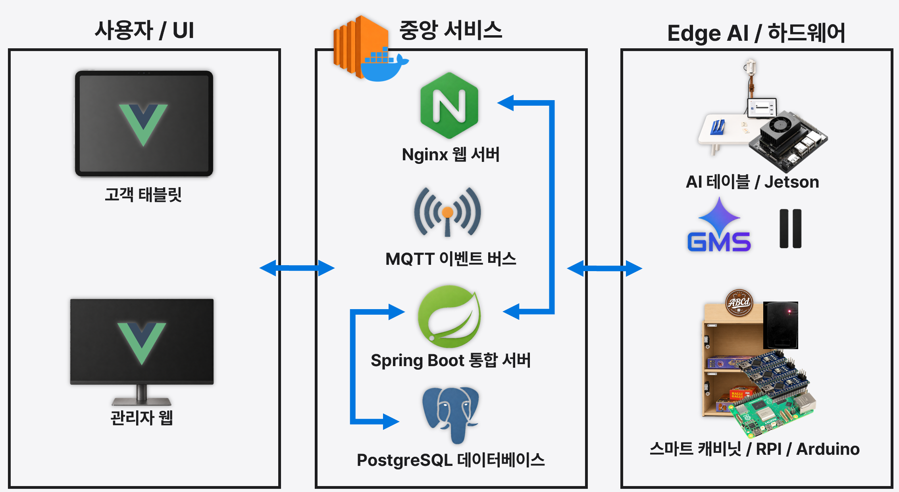
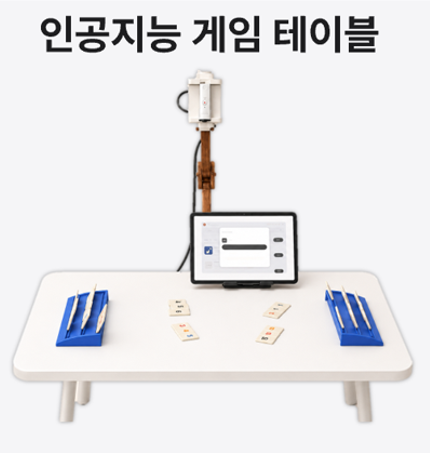
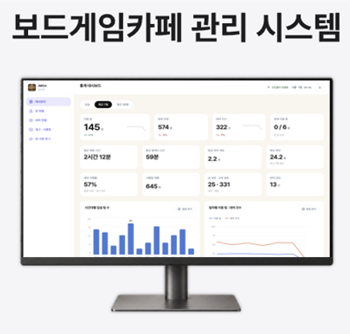
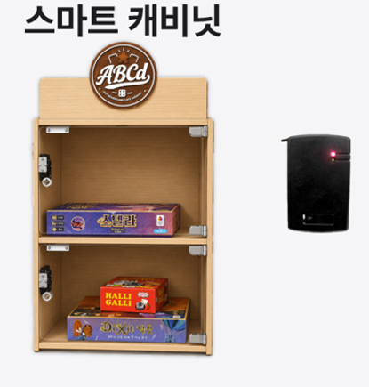
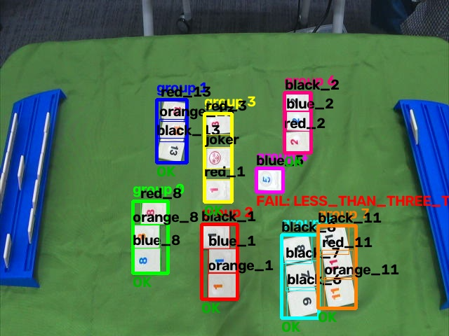
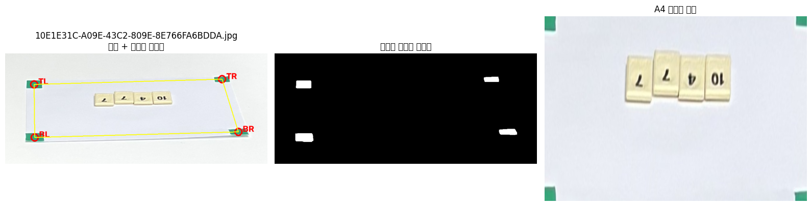
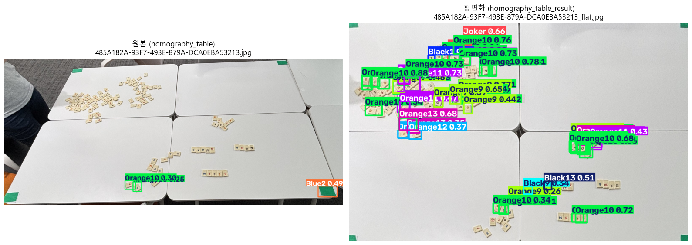

# ABCd — AIoT Boardgame Café daemon

SSAFY 15기 공통 프로젝트 (A402팀) · 2026.07.13 ~ 2026.08.10 (5주)

> **안내**
> 전체 프로젝트 소스코드는 SSAFY에 **반출 신청(승인)이 필요**하여 이 저장소에 포함하지 못했습니다. 양해 부탁드립니다.
> 이 저장소에는 프로젝트 개요, 제가 맡은 **루미큐브 AI 진행자(mc)** 의 진행 내용, 그리고 제가 직접 연구한 **YOLO 관련 파일**([`yolo-research/`](yolo-research/))만 정리했습니다.

---

## 1. 프로젝트 소개

스마트 캐비닛과 RFID 카드키로 보드게임의 **예약·대여·반납을 자동화**하고, 테이블에 놓인 AI 장치가 **음성 룰 QnA**와 **카메라 기반 게임 진행 보조(루미큐브 반칙 판정)** 를 제공하는 AIoT 보드게임 카페 시스템입니다.

### 해결하려는 문제

보드게임 카페에서는

1. 이용자가 원하는 게임을 찾기 어렵고
2. 원하는 게임이 있어도 확보하기 어려울 때가 있으며
3. 규칙을 물어보려면 직원을 기다려야 합니다 → 게임에 몰입하기 어렵고 시간이 낭비됩니다.
4. 직원은 위치 안내·대여·규칙 설명 같은 반복 업무가 많고
5. 매장 현황을 실시간으로 파악하기 어려우며
6. 운영 데이터를 관리하기 어렵습니다.

### 주요 기능

- 태블릿에서 보드게임 검색, 상세 조회, 예약 및 대여
- RFID 카드 + 스마트 캐비닛으로 게임 수령·반납 (카드를 대면 해당 칸이 자동으로 열림)
- 음성 기반 보드게임 규칙 QnA ("싸피야" 호출어)
- **카메라 기반 루미큐브 턴 분석 및 반칙 감지** ← 담당
- 관리자용 운영 현황·통계 화면

### 시스템 구성

```text
 태블릿(Vue) ──REST── Spring Boot (EC2) ── PostgreSQL
      │                    │
      └────── MQTT ────────┼──── Jetson Orin Nano  ─ 테이블 AI (루미큐브 진행자 mc, 음성 QnA, 호출어)
            (Mosquitto)    └──── Raspberry Pi 5 ── Arduino 스마트 캐비닛 (RFID, 잠금장치, 문 센서)
```

<p align="center"></p>

### 전체 구성

<table>
<tr>
<td width="33%" align="center"></td>
<td width="33%" align="center"></td>
<td width="33%" align="center"></td>
</tr>
<tr>
<td align="center"><b>인공지능 게임 테이블</b><br>카메라 거치대 + Jetson + 태블릿<br>음성 룰 QnA, 루미큐브 반칙 판정</td>
<td align="center"><b>보드게임카페 관리 시스템</b><br>관리자 웹<br>운영 현황·통계 대시보드</td>
<td align="center"><b>스마트 캐비닛</b><br>RFID 카드 리더 + 잠금장치<br>게임 수령·반납 자동화</td>
</tr>
</table>

### 기술 스택

| 영역 | 기술 |
| --- | --- |
| Frontend | Vue 3, TypeScript, Vite, Tailwind CSS |
| Backend / Data | Java 21, Spring Boot, MyBatis, PostgreSQL, Qdrant |
| AI / Voice | Python, PyTorch, Ultralytics YOLO, OpenCV, ONNX Runtime, Gemini, ElevenLabs |
| IoT / Infra | Jetson Orin Nano, Raspberry Pi 5, Arduino, C++, MQTT(Mosquitto), Docker, Nginx, Jenkins |

### 팀 구성과 역할

| 이름 | 역할 | 주요 담당 |
| --- | --- | --- |
| **김형수 (본인)** | AI | **루미큐브 AI 진행자(mc)** — 타일 탐지·분류·그룹핑·규칙 판정 파이프라인, 데이터 구축과 평가, Jetson 배포, MQTT 연동 |
| 임다빈 | AI | 루미큐브 타일 데이터 라벨링 및 모델 학습/검증, 음성 규칙 QnA 서버(Gemini, TTS), MQTT 기반 QnA 흐름 |
| 박건우 | IoT / AI | 호출어(wake word) 감지 서비스, RFID 리더 SDK, 스마트 캐비닛 컨트롤러(Bluetooth RFCOMM·MQTT), 장비 없는 검증용 mock 서버 |
| 김지호 | IoT / 3D | 캐비닛 회로 설계 및 Arduino 펌웨어, 카메라 지지대 3D 프린팅 |
| 박준서 | Infra / FE / BE | 인프라, 프론트엔드, 백엔드 |

원본 GitLab 저장소의 작성자별 커밋 수와 본인 커밋 목록은 [`docs/contribution.md`](docs/contribution.md)에 남겨 두었습니다.

---

## 2. 담당: 루미큐브 AI 진행자 (mc)

플레이어가 턴을 마치면 Jetson의 카메라가 보드를 촬영하고, 놓인 타일 조합이 규칙에 맞는지 자동으로 판정해 태블릿으로 알려주는 기능입니다. **카메라 촬영 → 탐지 → 분류 → 그룹핑 → 규칙 판정 → MQTT 발행**까지 전 구간을 맡았습니다.

```text
Spring(Main Controller) ──MQTT cmd/analyze──▶ Jetson mc
                                                 │
   카메라 촬영 → YOLOv8n(타일 위치, 1클래스) → ResNet18 ×2(숫자 14 / 색상 5클래스, 배치 추론)
             → MST 기반 그룹 복원(멜드 단위) → 규칙 판정(런·세트·조커·초기 멜드 30점)
                                                 │
Spring ◀──MQTT event/turn-log 또는 event/violation──┘ ──▶ 태블릿
```

### 완성 결과

<p align="center"></p>

Jetson 카메라로 찍은 실제 보드를 분석한 결과입니다. 타일마다 숫자·색상 라벨을 붙이고, 멜드 단위로 그룹을 묶은 뒤 그룹별로 판정합니다. 런·세트로 성립하는 그룹은 `OK`, 타일이 3개 미만인 그룹은 `FAIL: LESS_THAN_THREE_TILES`처럼 판정하고, 결과를 MQTT로 백엔드에게 통신합니다.

### 진행 과정

| 시기 | 단계 | 내용 |
| --- | --- | --- |
| 07/22 ~ 07/23 | 웹캠 탐지·전처리 실험 | 공개 데이터로 학습된 53클래스 YOLO로 웹캠 실시간 탐지, 파노라마 촬영, 초록 테이프 4점 기준 **호모그래피 평면화**(A4 → 85×110cm 테이블), 배경(흰 책상 / 검정 매트)별 탐지 비교 |
| 07/23 ~ 07/29 | 데이터 구축 도구 | Gradio 기반 라벨링 스튜디오(MobileSAM 클릭 한 번 박스, 자동 라벨 초안, Roboflow Universe 공개 라벨 1,255장 변환), 단건/폴더/평탄화 검수 UI, 밝기·반전 증강 |
| 07/24 | 중간 발표 | "YOLO 기반 루미큐브 인식 모델 — 전처리와 데이터셋 추가를 통한 파인튜닝" |
| 07/26 ~ 07/31 | 백엔드 설계 | FastAPI 기반 설계 문서와 백엔드 초안([ABCD_AI](https://github.com/kimHySoo/ABCD_AI)) — 이후 일정·역할 분담에 맞춰 **FastAPI+DB → FastAPI 컨트롤러 → MQTT 워커**로 범위를 좁힘 |
| 07/30 ~ 07/31 | 2단계 구조 전환 | 53클래스 단일 YOLO 대신 **1클래스 타일 탐지 + ResNet18 숫자/색상 분류**로 문제를 분해, 외부 GPU 서버(L40S)에서 학습 |
| 08/01 ~ 08/06 | Jetson 배포·최적화 | MQTT 워커, 카메라 세션 유지, GPU 워밍업, 배치 분류, CMA 메모리 관리, TensorRT FP16 엔진 빌드, 분류기(멀티헤드 ResNet / MobileNetV3) 비교 |
| 08/07 | 실측 검증 | 실제 카메라 홀드아웃 **66장 정답을 사람이 전량 검수** → 탐지기 4종 비교, YOLO26n 폐기 → **YOLOv8n 확정** |
| 08/07 ~ 08/11 | 그룹핑 재설계 | 멜드 오병합 문제를 v1 → v2 → v3로 재설계, 08/11 Jetson 배포 |
| 08/12 | 정리 | 분류기 단독 평가, 신뢰구간 산출, 기술 문서화 |

### 핵심 결과

평가 데이터: Jetson 실제 촬영 경로로 찍은 홀드아웃 **66장**(PASS 52 / 반칙 14, 이미지당 평균 22.8타일). 모델 학습에는 쓰지 않았지만 모델 선택에 반복 사용한 개발용 검증 셋입니다.

**탐지기 4종 비교** — 증강 test 셋(944장)에서는 mAP50 0.995로 전부 동률이었지만, 실제 카메라에서는 크게 갈렸습니다.

| 탐지기 | 파라미터 | GFLOPs | mAP50-95 (증강 test 944장) | 타일 완전일치 (실제 카메라 66장) |
| --- | ---: | ---: | ---: | ---: |
| **YOLOv8n (채택)** | 3.01M | 8.1 | 0.853 | **97.0% (64/66)** |
| YOLOv8s | 11.13M | 28.4 | 0.854 | 93.9% (62/66) |
| YOLO11n | 2.58M | 6.3 | 0.854 | 93.9% (62/66) |
| YOLO26n | 2.38M | 5.2 | 0.849 | 80.3% (53/66) |

**단일 53클래스 YOLO vs 2단계(탐지 + 분류)**

| 방식 | 타일 F1 | 완전일치 |
| --- | ---: | ---: |
| 단일 53클래스 YOLO (체크포인트 2종) | 74.4% / 62.3% | 0/66 |
| **YOLOv8n + ResNet18 ×2 (채택)** | **99.9%** | **64/66** |

**그 밖의 지표**

| 항목 | 결과 |
| --- | --- |
| 분류기 단독 (사람이 검수한 bbox 크롭 1,506개) | ResNet18 숫자+색상 결합 **99.93%** vs MobileNetV3-Small 98.47% |
| 그룹핑 5종 비교 (실제 예측 입력) | MST + 간선 기반 복구(v3) **F1 95.4%, 보드 완전일치 83.3%** (DBSCAN 88.6% / 56.1%) |
| End-to-end PASS/FAIL 판정 | **92.4% (61/66)**, 95% CI 83.2 ~ 97.5% · 반칙 놓침 1/14 · 정상 오판 4/52 |
| Jetson latency (YOLOv8s → v8n) | 탐지 824ms → 396ms (**-51.9%**), 측정 구간 합계 2,695ms → 2,170ms (**-19.5%**) · 전력 모드 미고정 잠정치 |

### 문제 해결 사례

**1. 벤치마크 1등 ≠ 실전 1등 — YOLO26n 채택 후 폐기**
증강 test 셋 mAP 동률과 Jetson latency 개선(-11.8%)을 근거로 YOLO26n을 프로덕션에 넣었습니다. 이후 실제 카메라 66장 정답을 직접 만들어 재검증하자 타일 완전일치가 80.3%에 그쳐 되돌렸고, 4종을 같은 조건으로 다시 비교해 YOLOv8n으로 확정했습니다. 증강 데이터만으로는 실제 촬영 조건의 차이를 잡지 못한다는 것을 확인한 뒤, 실제 카메라 재검증을 모델 교체의 필수 절차로 두었습니다.

**2. 정상 조합을 반칙으로 보고하던 그룹핑 — v1 → v2 → v3**
보드에 타일이 많아지면 서로 다른 멜드가 하나로 합쳐졌고, 그 결과 `[3,3,3]` 세트와 `[11,12,13]` 런처럼 둘 다 정상인 조합이 반칙(`event/violation`)으로 보고됐습니다. v1(전부 유효해야 채택)은 낱장 타일이 있으면 실패했고, v2(긴 간선을 무조건 끊고 재귀)는 진짜 반칙 그룹까지 조각내 F1이 오히려 떨어졌습니다. 최종 v3는 MST 간선을 긴 것부터 시험 삼아 끊어 보고 **한쪽이 즉시 유효한 그룹이 되는 컷만 채택**하는 방식으로, F1 94.3% → 95.4%, 보드 완전일치 78.8% → 83.3%로 개선했습니다.

**3. 1클래스로 바꿨는데도 탐지가 전혀 안 되던 학습**
라벨을 전부 `tile` 1클래스로 바꾼 데이터셋을 symlink로 만들었는데, `Path.resolve()`가 링크를 원본 경로로 따라가면서 Ultralytics가 새 라벨이 아닌 **원본 53클래스 라벨**을 읽고 있었습니다. symlink를 실제 복사로 바꾸고 라벨이 전부 class 0인지 전수 검사하는 셀을 추가했습니다. 증강 데이터는 원본 이미지 단위로 먼저 train/val/test를 나눈 뒤 증강해 같은 원본이 split을 넘나드는 누수도 막았습니다.

**4. 정답 데이터 자체를 검증 — 검수 도구 3종**
bbox·라벨 검수 UI와 그룹 경계 검수 UI를 직접 만들어 66장 전량을 사람이 검수했습니다. 이 과정에서 처음에 "모델 오탐"으로 기록했던 결과가 실은 **정답에서 타일이 빠진 것**이었음을 찾는 등 정답 오류 2건을 수정했고, 모델 예측으로 만든 그룹 정답을 그대로 쓰던 순환 평가도 사람 검수 정답으로 교체했습니다.

### Jetson 배포

- 하드웨어: NVIDIA Jetson Orin Nano Super (JetPack 6.2.1, CUDA 12.6)
- 다른 서비스와 GPU 메모리(CMA)를 공유해야 해서, 턴마다 모델 로드 → 추론 → 해제로 유휴 시 GPU 점유 0
- 게임 시작 시 더미 입력으로 GPU를 미리 데워 콜드 스타트 비용을 보드 세팅 시간으로 이전
- 크롭 전체를 하나의 배치로 묶어 숫자/색상 분류기를 한 번씩만 호출
- 게임 시작~종료 동안 카메라 연결 유지, OS 파일 락으로 MQTT 핸들러 중복 실행 방지

### 한계

- 66장은 모델 선택에 반복 사용한 개발용 검증 셋이고 표본이 작아 신뢰구간이 넓습니다(반칙 놓침 1/14의 95% CI 0.2 ~ 33.9%). 독립 test 셋은 아직 만들지 못했습니다.
- 탐지·분류 지표는 라벨 multiset 비교이며, IoU 기반 mAP 평가는 아닙니다.
- Jetson latency는 촬영·그룹핑·MQTT 통신을 뺀 부분 구간 측정입니다.

---

## 3. YOLO 연구 파일 — [`yolo-research/`](yolo-research/)

제가 직접 진행한 YOLO 관련 실험 코드와 노트북만 모았습니다. 학습 가중치(`.pt`), 촬영 원본 데이터, 가상환경, 그리고 프로젝트 본체 코드(mc 파이프라인·규칙·MQTT)는 포함하지 않았습니다.

| 폴더 | 내용 |
| --- | --- |
| [`01_webcam-preprocessing/`](yolo-research/01_webcam-preprocessing/) | 웹캠 실시간 탐지, 파노라마 촬영, 호모그래피 평면화, 배경별 탐지 비교 |
| [`02_labeling-studio/`](yolo-research/02_labeling-studio/) | 라벨링 스튜디오(MobileSAM, 자동 라벨), 검수 UI, 증강, 데이터 검사, 학습·평가 스크립트 |
| [`03_yolo-training/`](yolo-research/03_yolo-training/) | 53클래스 YOLO → 1클래스 타일 탐지 전환, 증강·누수 없는 분할, YOLOv8s/v8n/11n/26n 학습 |
| [`04_detector-evaluation/`](yolo-research/04_detector-evaluation/) | 실제 카메라 홀드아웃 채점, 단일 53클래스 YOLO 평가, 정답 검수용 데이터셋 변환 |

<table>
<tr>
<td width="50%"></td>
<td width="50%"></td>
</tr>
<tr>
<td>초록 테이프 4점 검출 → A4 평면화</td>
<td>초기 53클래스 모델: 평면화 후에도 타일 상당수를 Orange10 등으로 오인식 → 2단계 구조로 전환한 배경</td>
</tr>
</table>

자세한 파일별 설명은 [`yolo-research/README.md`](yolo-research/README.md)에 있습니다.

---

## 4. 회고

루미큐브 보드를 카메라로 찍으면 반칙 여부를 자동으로 판정해주는 AI 진행자(mc)를 맡았습니다. 타일 탐지, 숫자·색상 분류, 그룹핑, 규칙 판정까지 이어지는 파이프라인 전체를 설계하고 구현했습니다.

가장 오래 걸린 건 모델 학습 데이터 수집과 학습이었습니다. 실제 카메라로 찍은 보드 사진을 모으고, 타일 라벨(숫자·색상·조커)과 그룹 경계를 사람이 직접 검수해서 정답 데이터를 만들었고, 탐지기와 분류기를 여러 모델로 각각 학습시켜 비교했습니다. 임계값 하나 바꾸는 데도 결과가 크게 달라져서, 수치를 보며 값을 조정하고 다시 학습·검증하는 과정을 여러 차례 반복해야 했습니다.

그룹핑 로직도 까다로운 문제였습니다. 서로 다른 멜드가 하나로 잘못 합쳐지는 문제를 고치려고 알고리즘을 세 번 다시 설계했는데, 그 과정에서 그룹핑이 실패하면 정상적으로 낸 조합이 그대로 반칙으로 포함되어 전달된다는 걸 알게 됐습니다. 이후 복구 기능을 추가하여 보조하였습니다.

알고리즘 기반 기능과 AI 기반 기능을 함께 진행하면서 개발 방식의 차이도 느꼈습니다. 그룹핑 로직은 코드를 고치고 바로 결과를 눈으로 확인할 수 있어서 반복 속도는 빨랐지만, 체인 중간에 낀 그룹이나 낱장 타일 같은 예외 상황을 하나씩 조건문으로 처리하다 보니 로직이 점점 꼬이고 복잡해지는 문제가 있었습니다. 반면 AI 모델은 데이터를 다시 모으고 학습시키는 데 시간이 오래 걸렸지만, 한 번 잘 학습시켜두면 개별 예외 상황을 일일이 조건문으로 추가하지 않아도 데이터 자체가 그런 변형들을 흡수하기에 차이를 느꼈습니다.

마지막으로 제대로 된 하나를 만들려고 했는데, 그래도 조금 더 욕심을 내서 다양한 게임을 추가했으면 좋았겠다는 아쉬움이 남습니다.
